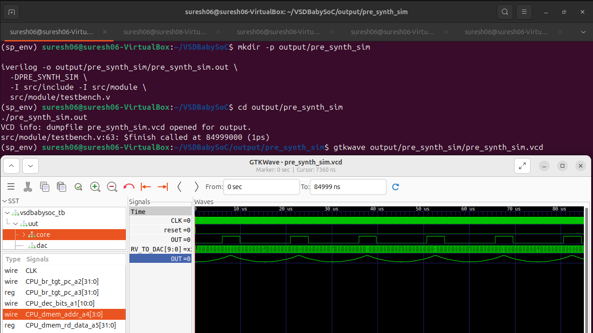
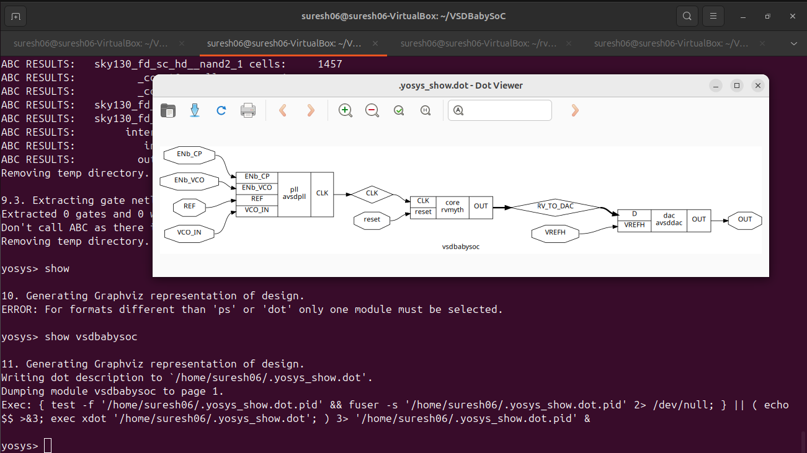

# Week 2 – BabySoC Functional Modelling using Icarus Verilog and GTKWave

This part of the week-2 task focuses on understanding the BabySoC’s internal structure through functional modelling.  
All simulations are done using **Icarus Verilog (iverilog)** and **GTKWave** to observe and analyze real signal interactions inside the SoC before RTL or synthesis stages.

---

## Overview

Functional modelling helps validate the logical behavior of the entire SoC system at an early stage.  
The **BabySoC** consists of essential blocks like:
- **Clock generator (clkgen)** – produces system clock and reset signals.  
- **Memory (vsdmem)** – stores data and instruction space.  
- **PWM module (pwm)** – produces pulse-width modulated signals.  
- **Counter module (counter)** – demonstrates peripheral behavior.  
- **Top module (vsdbabysoc)** – integrates all functional submodules.  

Functional modelling confirms that each module interacts properly through control and data paths, simulating an SoC-like operation environment.

---

## Project Setup

Clone the BabySoC repository:
```bash
git clone https://github.com/hemanthkumardm/SFAL-VSD-SoCJourney.git
cd SFAL-VSD-SoCJourney/12.VSDBabySoC_Project
````

Install the required tools:

```bash
sudo apt-get install iverilog gtkwave
```

## Cloning the Project
To begin, clone the VSDBabySoC repository using the following command:
```
git clone https://github.com/manili/VSDBabySoC.git

cd ~/VLSI/VSDBabySoC/

ls VSDBabySoC/
images  LICENSE  Makefile  README.md  src

cd src/module/
ls
avsddac.v  clk_gate.v    pseudo_rand_gen.sv  rvmyth_gen.v  rvmyth.v           testbench.rvmyth.post-routing.v  vsdbabysoc.synth.v
avsdpll.v  primitives.v  pseudo_rand.sv      rvmyth.tlv    sky130_fd_sc_hd.v  testbench.v*                     vsdbabysoc.v
```

## TLV to Verilog Conversion for RVMYTH
Initially, you will see only the rvmyth.tlv file inside src/module/, since the RVMYTH core is written in TL-Verilog.
To convert it into a .v file for simulation, follow the steps below:
TLV to Verilog Conversion Steps

```
# Step 1: Install python3-venv (if not already installed)
sudo apt update
sudo apt install python3-venv python3-pip

# Step 2: Create and activate a virtual environment
cd VSDBabySoC/
python3 -m venv sp_env
source sp_env/bin/activate

# Step 3: Install SandPiper-SaaS inside the virtual environment
pip install pyyaml click sandpiper-saas

# Step 4: Convert rvmyth.tlv to Verilog
sandpiper-saas -i ./src/module/*.tlv -o rvmyth.v --bestsv --noline -p verilog --outdir ./src/module/
```
## VSDBabySoC RTL to Gate-Level Simulation Flow

### 1. Pre-Synthesis Simulation: 
Run the following command to perform a pre-synthesis simulation:
```
iverilog -o output/pre_synth_sim/pre_synth_sim.out   -DPRE_SYNTH_SIM   -I src/include   -I src/module   src/module/testbench.v
```



- Output: output/pre_synth_sim/pre_synth_sim.vcd (waveform if $dumpfile is used in testbench).
- This is your reference RTL behavior.

### 2. RTL Synthesis using Yosys
 
```
 cd VSDBabySoC/
 yosys
```
```
yosys> read_verilog  -sv -I src/include/ -I src/module/ src/module/vsdbabysoc.v src/module/clk_gate.v src/module/rvmyth.v

yosys> read_liberty -lib ~/VSDBabySoC/src/lib/sky130_fd_sc_hd__tt_025C_1v80.lib

read_liberty -lib src/lib/avsddac.lib
 
read_liberty -lib src/lib/avsdpll.lib

read_liberty -lib src/lib/sky130_fd_sc_hd__tt_025C_1v80.lib

synth -top vsdbabysoc

write_verilog vsdbabysoc.synth.v

abc -liberty src/lib/sky130_fd_sc_hd__tt_025C_1v80.lib

show vsdbabysoc
```


### 3. Post-Synthesis Simulation:
```
iverilog -o output/post_synth_sim/post_synth_sim.out -DPOST_SYNTH_SIM  -I src/include/ -I src/module/ src/module/testbench.v
```


# Why Pre-Synthesis and Post-Synthesis?
**1️⃣Pre-Synthesis Simulation:**

  - Focuses only on verifying functionality based on the RTL code.
  - Zero-delay environment, with events occurring on the active clock edge.

    
**2️⃣Post-Synthesis Simulation (GLS):**

  - Uses the synthesized netlist (gate-level) to simulate both functionality and timing.
  - Identifies timing violations and potential mismatches (e.g., unintended latches).
  - Helps verify dynamic circuit behavior that static methods may miss.


---


##  Observations and Results

Include screenshots from GTKWave showing:

**(a) Reset Operation**
At the beginning of simulation, reset is active. All internal registers (counter, PWM, memory) initialize to zero.
This confirms that global reset synchronization works across all submodules.

**(b) Clocking Behavior**
Clock toggles consistently with 10ns period. Counter and PWM outputs show synchronous updates on rising edges.

**(c) Dataflow between Modules**
Counter output feeds PWM duty cycle and memory address input, verifying inter-module connectivity.


---

## Key Takeaways

Functional modelling of BabySoC verifies the integration of digital modules before synthesis or layout.

* Confirms system clock and reset domain behavior.
* Validates sequential logic interaction between memory, counter, and PWM.
* Allows debugging of early logic or connectivity errors through simulation.
* Establishes a foundation for later RTL refinement and physical design.

---

## 10. References

* [VSD SoC Journey – BabySoC Project](https://github.com/hemanthkumardm/SFAL-VSD-SoCJourney/tree/main/12.%20VSDBabySoC%20Project)
* [Sky130 PDK Documentation](https://skywater-pdk.readthedocs.io/)
* [Icarus Verilog Reference](http://iverilog.icarus.com/)
* [GTKWave Manual](http://gtkwave.sourceforge.net/)

---

